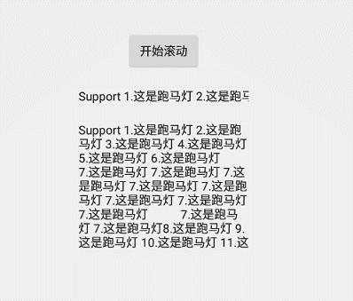
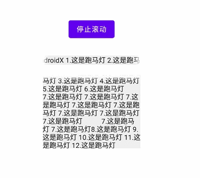

# 此项目已迁移至[Widgets](https://github.com/guodongAndroid/widgets.git)，后期不再维护。

# MarqueeTextView

[](https://jitpack.io/#guodongAndroid/marquee)

横向、竖向跑马灯





**集成步骤**

- 在项目根目录下的 build.gradle 文件中加入

```groovy
allprojects {
	repositories {
		...
		maven { url 'https://jitpack.io' }
	}
}
```

- 在项目 app 模块下的 build.gradle 文件中加入

```groovy
dependencies {
    // androidx
    implementation 'com.github.guodongAndroid.marquee:androidx:0.0.3'
    
    // support
    implementation 'com.github.guodongAndroid.marquee:support:0.0.3'
}
```

**AndroidX**

```xml
<?xml version="1.0" encoding="utf-8"?>
<androidx.constraintlayout.widget.ConstraintLayout xmlns:android="http://schemas.android.com/apk/res/android"
    xmlns:app="http://schemas.android.com/apk/res-auto"
    xmlns:tools="http://schemas.android.com/tools"
    android:layout_width="match_parent"
    android:layout_height="match_parent"
    tools:context=".MainActivity">

    <Button
        android:id="@+id/btn_marquee"
        android:layout_width="wrap_content"
        android:layout_height="wrap_content"
        android:text="开始滚动"
        app:layout_constraintBottom_toBottomOf="parent"
        app:layout_constraintEnd_toEndOf="parent"
        app:layout_constraintStart_toStartOf="parent"
        app:layout_constraintTop_toTopOf="parent"
        app:layout_constraintVertical_bias="0.2" />

    <com.guodongandroid.marquee.androidx.HorizontalMarqueeTextView
        android:id="@+id/androidx_horizontal"
        android:layout_width="200dp"
        android:layout_height="wrap_content"
        android:ellipsize="marquee"
        android:layout_marginTop="30dp"
        android:marqueeRepeatLimit="marquee_forever"
        android:singleLine="true"
        android:text="AndroidX 1.这是跑马灯 2.这是跑马灯 3.这是跑马灯 4.这是跑马灯"
        app:layout_constraintLeft_toLeftOf="parent"
        app:layout_constraintRight_toRightOf="parent"
        app:layout_constraintTop_toBottomOf="@id/btn_marquee" />

    <com.guodongandroid.marquee.androidx.VerticalMarqueeTextView
        android:id="@+id/androidx_vertical"
        android:layout_width="200dp"
        android:layout_height="150dp"
        android:layout_marginTop="20dp"
        android:ellipsize="marquee"
        android:text="AndroidX 1.这是跑马灯 2.这是跑马灯 3.这是跑马灯 4.这是跑马灯 5.这是跑马灯 6.这是跑马灯
         7.这是跑马灯 7.这是跑马灯 7.这是跑马灯 7.这是跑马灯 7.这是跑马灯 7.这是跑马灯 7.这是跑马灯 7.这是跑马灯
          7.这是跑马灯 7.这是跑马灯8.这是跑马灯 9.这是跑马灯 10.这是跑马灯 11.这是跑马灯 12.这是跑马灯
           13.这是跑马灯 14.这是跑马灯 15.这是跑马灯 16.这是跑马灯"
        app:layout_constraintLeft_toLeftOf="parent"
        app:layout_constraintRight_toRightOf="parent"
        app:layout_constraintTop_toBottomOf="@id/androidx_horizontal" />

</androidx.constraintlayout.widget.ConstraintLayout>
```

```java
public class MainActivity extends AppCompatActivity {

    private HorizontalMarqueeTextView mHorizontalMarqueeTextViewX;
    private VerticalMarqueeTextView mVerticalMarqueeTextViewX;

    private Button mBtnMarquee;

    @Override
    protected void onCreate(Bundle savedInstanceState) {
        super.onCreate(savedInstanceState);
        setContentView(R.layout.activity_main);

        mBtnMarquee = findViewById(R.id.btn_marquee);
        mHorizontalMarqueeTextViewX = findViewById(R.id.androidx_horizontal);
        mVerticalMarqueeTextViewX = findViewById(R.id.androidx_vertical);

        mBtnMarquee.setOnClickListener(v -> {
            mBtnMarquee.setSelected(!mBtnMarquee.isSelected());
            boolean selected = mBtnMarquee.isSelected();
            if (selected) {
                mBtnMarquee.setText("停止滚动");
            } else {
                mBtnMarquee.setText("开始滚动");
            }

            mHorizontalMarqueeTextViewX.setMarquee(selected);
            mVerticalMarqueeTextViewX.setMarquee(selected);
        });
    }
}
```


**Support**

```xml
<?xml version="1.0" encoding="utf-8"?>
<android.support.constraint.ConstraintLayout xmlns:android="http://schemas.android.com/apk/res/android"
    xmlns:app="http://schemas.android.com/apk/res-auto"
    xmlns:tools="http://schemas.android.com/tools"
    android:layout_width="match_parent"
    android:layout_height="match_parent"
    tools:context=".MainActivity">

    <Button
        android:id="@+id/btn_marquee"
        android:layout_width="wrap_content"
        android:layout_height="wrap_content"
        android:text="开始滚动"
        app:layout_constraintBottom_toBottomOf="parent"
        app:layout_constraintEnd_toEndOf="parent"
        app:layout_constraintStart_toStartOf="parent"
        app:layout_constraintTop_toTopOf="parent"
        app:layout_constraintVertical_bias="0.2" />

    <com.guodongandroid.marquee.support.HorizontalMarqueeTextView
        android:id="@+id/support_horizontal"
        android:layout_width="200dp"
        android:layout_height="wrap_content"
        android:layout_marginTop="20dp"
        android:ellipsize="marquee"
        android:marqueeRepeatLimit="marquee_forever"
        android:singleLine="true"
        android:text="Support 1.这是跑马灯 2.这是跑马灯 3.这是跑马灯 4.这是跑马灯"
        app:layout_constraintLeft_toLeftOf="parent"
        app:layout_constraintRight_toRightOf="parent"
        app:layout_constraintTop_toBottomOf="@id/btn_marquee" />

    <com.guodongandroid.marquee.support.VerticalMarqueeTextView
        android:id="@+id/support_vertical"
        android:layout_width="200dp"
        android:layout_height="150dp"
        android:layout_marginTop="20dp"
        android:ellipsize="marquee"
        android:text="Support 1.这是跑马灯 2.这是跑马灯 3.这是跑马灯 4.这是跑马灯 5.这是跑马灯 6.这是跑马灯
         7.这是跑马灯 7.这是跑马灯 7.这是跑马灯 7.这是跑马灯 7.这是跑马灯 7.这是跑马灯 7.这是跑马灯 7.这是跑马灯
          7.这是跑马灯 7.这是跑马灯8.这是跑马灯 9.这是跑马灯 10.这是跑马灯 11.这是跑马灯 12.这是跑马灯
           13.这是跑马灯 14.这是跑马灯 15.这是跑马灯 16.这是跑马灯"
        app:layout_constraintLeft_toLeftOf="parent"
        app:layout_constraintRight_toRightOf="parent"
        app:layout_constraintTop_toBottomOf="@id/support_horizontal" />

</android.support.constraint.ConstraintLayout>
```

```java
public class MainActivity extends AppCompatActivity {

    private HorizontalMarqueeTextView mHorizontalMarqueeTextViewS;
    private VerticalMarqueeTextView mVerticalMarqueeTextViewS;

    private Button mBtnMarquee;

    @Override
    protected void onCreate(Bundle savedInstanceState) {
        super.onCreate(savedInstanceState);
        setContentView(R.layout.activity_main);

        mBtnMarquee = findViewById(R.id.btn_marquee);
        mHorizontalMarqueeTextViewS = findViewById(R.id.support_horizontal);
        mVerticalMarqueeTextViewS = findViewById(R.id.support_vertical);

        mBtnMarquee.setOnClickListener(v -> {
            mBtnMarquee.setSelected(!mBtnMarquee.isSelected());
            boolean selected = mBtnMarquee.isSelected();
            if (selected) {
                mBtnMarquee.setText("停止滚动");
            } else {
                mBtnMarquee.setText("开始滚动");
            }

            mHorizontalMarqueeTextViewS.setMarquee(selected);
            mVerticalMarqueeTextViewS.setMarquee(selected);
        });
    }
}
```

